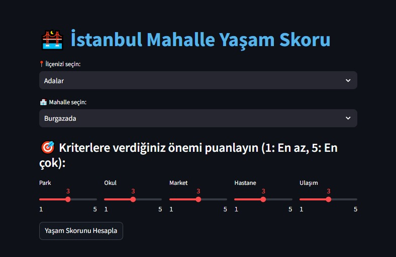
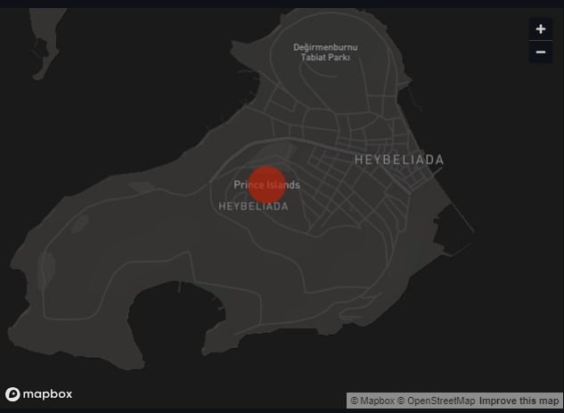
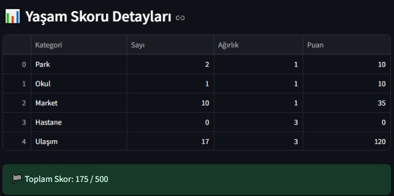
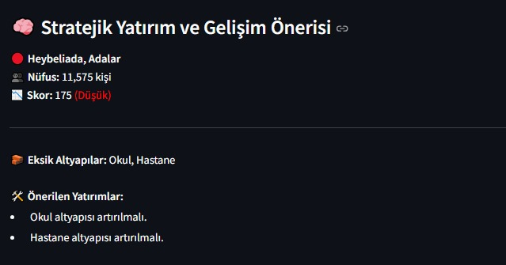

# 🏙️ İstanbulSkor – Mahalle Bazlı Yaşam Skoru ve Stratejik Gelişim Aracı

İstanbulSkor, İstanbul’un mahalle düzeyinde yaşam kalitesini veri odaklı olarak analiz eden ve stratejik gelişim önerileri sunan bir karar destek sistemidir. Kullanıcıların belirlediği önceliklere göre mahallelerin skoru hesaplanır ve altyapı eksiklikleri belirlenerek öneriler sunulur.

---

## 🚀 Projenin Amacı

- İstanbul’daki mahallelerin **15 dakikalık yürüme mesafesi** içinde ne kadar yaşanılabilir olduğunu tespit etmek  
- Gerçek zamanlı **altyapı verilerini** kullanarak **dinamik skor** hesaplamak  
- Belediye, yatırımcı ve şehir plancıları için **karar destek sistemi** sunmak

---

## 🧩 Kullanıcı Deneyimi

1. İlçe ve mahalle seçimi yapılır  
2. Kullanıcı, kriterleri (okul, park, ulaşım vb.) **1-5 arasında puanlayarak önceliklendirir**  
3. Sistem, OpenStreetMap verisiyle 15 dakikalık yürüme alanında altyapı öğelerini analiz eder  
4. Skor, tablo ve harita görselleştirmesi anlık olarak kullanıcıya sunulur  
5. Stratejik gelişim önerileri otomatik olarak oluşturulur

---

## 🧠 Kullanılan Teknolojiler

- `osmnx`: OpenStreetMap üzerinden altyapı verisi  
- `geopy`: Mahalle koordinatlarının tespiti  
- `folium & pandas`: Harita katmanları ve veri işleme  
- `streamlit`: Hızlı ve etkileşimli web arayüzü

---

## 📷 Örnek Ekran Görüntüleri

### 1. Giriş Ekranı – İlçe/Mahalle Seçimi ve Önceliklendirme

### 2. Harita Görselleştirmesi

### 3. Skor Tablosu ve Detaylar

### 4. 15 Dakikalık Erişim Uyum Durumu

### 5. Stratejik Gelişim Önerileri

---

## 🧭 15 Dakika Kuralı

Projenin merkezinde, **15 dakikalık yürüme mesafesinde** ulaşılabilir altyapı öğeleri (okul, market, park, hastane, ulaşım) yer alır. Bu kriterlere göre mahalleler analiz edilir ve eksik alanlara odaklanılır.

---

## 📊 Yaşam Skoru Nasıl Hesaplanır?

- Toplam skor 500 puanlık bir ölçekle hesaplanır
- Her kategori (örneğin okul, park) kullanıcı ağırlığına göre 100 puana kadar katkı sağlar
- Daha fazla yer daha yüksek skor, daha az yer daha düşük skor anlamına gelir
- Skor: Sayı x Ağırlık ile hesaplanır

---

## 📈 Strateji Geliştirme

Skoru düşük, nüfusu yüksek mahallelerde sistem otomatik olarak stratejik öneriler üretir:  
🧱 Eksik altyapıların tespiti  
🛠️ Her kategoriye özel yatırım önerisi  
📌 Karar vericiler için mahalleye özel çözüm rehberi

